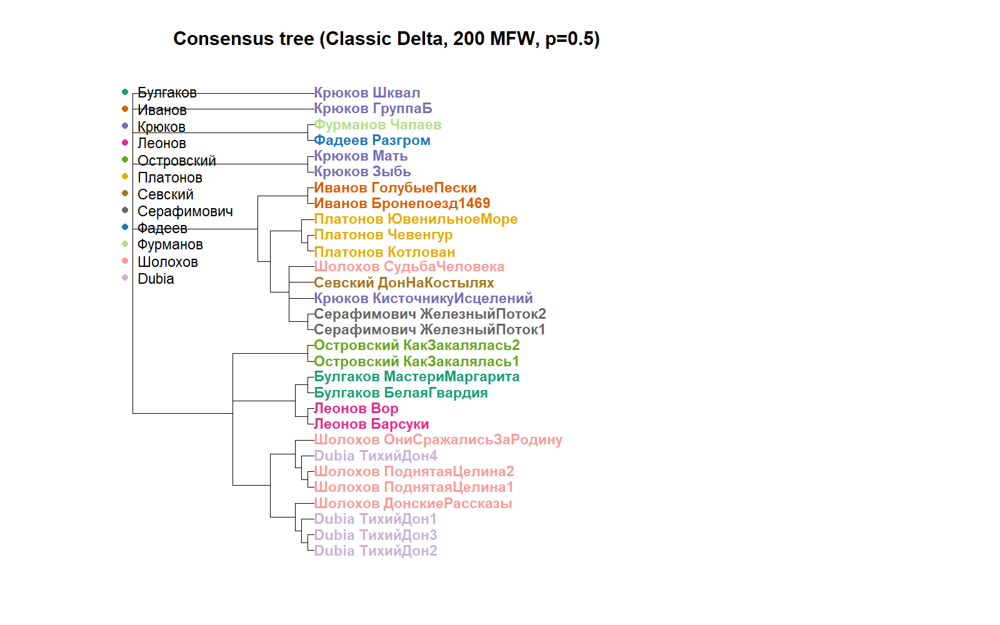

# ДЗ 17 — Консенсусное дерево

**ФИО:** Михаил Михаил Олегович 
**Дата:** 15 февраля 2026  

---

## Комментарий

Для анализа были выбраны 500 наиболее частотных слов, чтобы исключить редкую лексику, зависящую от тематики текста.

Консенсусное дерево строилось на основе 100 деревьев.  
Каждое дерево получено по случайной подвыборке из 200 слов.

Использована метрика Classic Delta (z-стандартизация + манхэттенское расстояние),  
кластеризация — методом средней связи (average linkage).  

Консенсус строился по правилу простого большинства (p = 0.5).

---

## Код

См. файл `hw17.R` в этом репозитории.

---

## Результат

